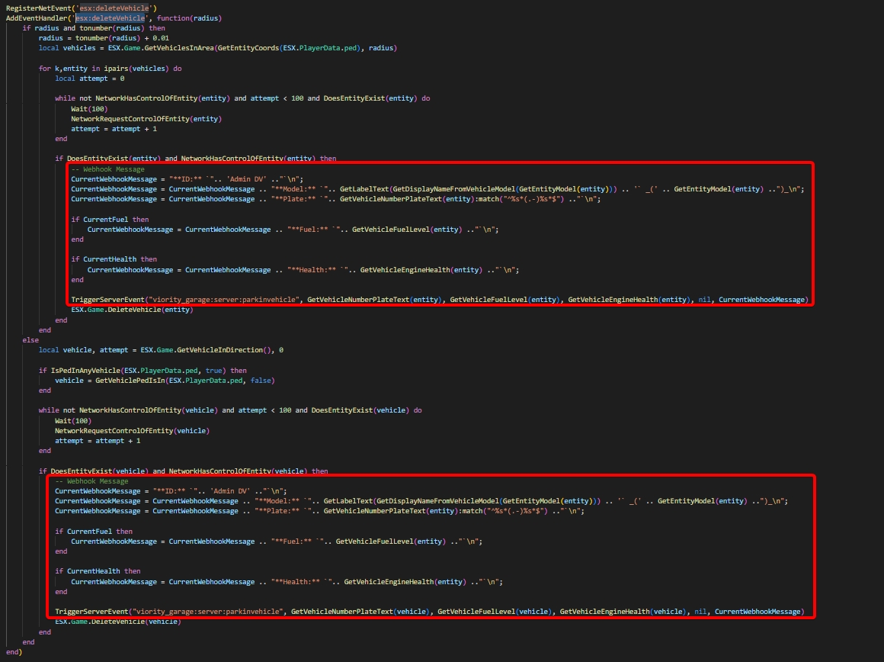

# VehicleParkIn DV


This es\_extended integration is optional. Please follow all steps carefully!


#### 1. Modify the ESX Framework

&#x20;   1.1 Go to the `es_extended` folder.\
&#x20;   1.2 Open the File `client > main.lua`.\
&#x20;   1.3 Search the NetEvent `esx:deleteVehicle`.\
&#x20;   1.4 Add this line in the function.


```lua
-- Webhook Message
CurrentWebhookMessage = "**ID:** `".. 'Admin DV' .."`\n";
CurrentWebhookMessage = CurrentWebhookMessage .. "**Model:** `".. GetLabelText(GetDisplayNameFromVehicleModel(GetEntityModel(entity))) .. '` _(' .. GetEntityModel(entity) ..")_\n";
CurrentWebhookMessage = CurrentWebhookMessage .. "**Plate:** `".. GetVehicleNumberPlateText(entity):match("^%s*(.-)%s*$") .."`\n";

if GetVehicleFuelLevel(entity) then
CurrentWebhookMessage = CurrentWebhookMessage .. "**Fuel:** `".. 		GetVehicleFuelLevel(entity) .."`\n";
end

if GetVehicleEngineHealth(entity) then
CurrentWebhookMessage = CurrentWebhookMessage .. "**Health:** `".. GetVehicleEngineHealth(entity) .."`\n";
end

TriggerServerEvent("viority_garage:server:parkinvehicle", GetVehicleNumberPlateText(entity), GetVehicleFuelLevel(entity), GetVehicleEngineHealth(entity), nil, CurrentWebhookMessage)
```


<figure><figcaption><p>NetEvent Example</p></figcaption></figure>


Please note that the vehicle object in the second If is called vehicle instead of entity!

