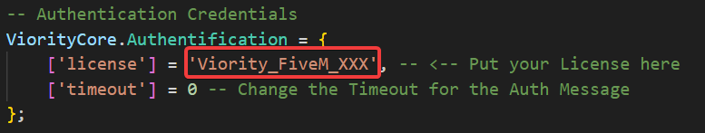

# Configuration


THIS IS _DEPRECATED_ **SINCE** THE **TRANSITION TO KEYMASTER**



In this chapter, the product will be configured locally, authentication will be prepared and it will be made ready for usage.


#### 1. Find and enter the product license

&#x20;   1.1 Go to our [official discord server](https://discord.gg/323HfHyGW4).\
&#x20;   1.2 Enter the customer channel [「🤖」commands](https://canary.discord.com/channels/420677294345158657/863143715472015381).\
&#x20;   1.3 Enter the command `/license`. \
&#x20;   1.4 Now an embed message from our System Bot `Viority Development#4188` is displayed. \
&#x20;   1.5 Click on the dropdown menu and choose your product. For example `Viority Cardealer`. \
&#x20;   1.6 The bot will now send you a direct message with the requested information.\
&#x20;   1.7 Now you need the highlighted license as shown in the image below.

.png>)

&#x20;   1.8 Save this license to your clipboard.\
&#x20;   1.9 Now open ViorityCore, located in the product folder under `Settings < ViorityCore.lua`.\
&#x20;   1.10 Enter the copied license in the gap below under `license` like the example picture.

<figure><figcaption>
ViorityCore License Gap Example
</figcaption></figure>


If you are configuring authentication for the very first time, you can skip **2. Prepare the Authentication.** Our system will enter the first used IPv4 address automatically.&#x20;


#### 2. Prepare the Authentication&#x20;

&#x20;   2.1 Go to our [official discord server](https://discord.gg/323HfHyGW4).\
&#x20;   2.2 Enter the customer channel [「🤖」commands](https://canary.discord.com/channels/420677294345158657/863143715472015381).\
&#x20;   2.3 Enter the command `/settings`. \
&#x20;   2.4 Now an embed message from our System Bot `Viority Development#4188` is displayed. \
&#x20;   2.5 Then click on the button `Viority Product` and then `Change IP´s and License`.\
&#x20;   2.6 Click on the dropdown menu and choose your product. For example `Viority Cardealer`.\
&#x20;   2.7 After that click on the button `Change IP´s`.\
&#x20;   2.8 Now enter your IPv4 address, but note that you only have 1 minute to enter.\
&#x20;   2.9 If you have entered a valid IPv4 address during this period the change is now effective!

.png>)


If you do not know your primary IPv4 address, ask your hoster or use a [detection service](https://www.wieistmeineip.de/).


#### 3. Configure the ViorityCore&#x20;

&#x20;   3.1 Configure **all** important initial entries for your specific server!!

&#x20;   3.2 Change the `GetIdentifier` Function! Check your Database!!!\

.png>)

.png>)


#### Attention! Special case!


.png>)


You will find the identifiers in the "users" table in your database!


&#x20;   3.3 Adjust the entries under `SQL_Tables`, if available, according to your database!\
&#x20;   3.4 Customise the rest of ViorityCore to customize the product to your server.\
&#x20;   3.5 _<mark style="color:blue;">**OPTIONAL**</mark>_ Activate the `DebugMode` to identifier an error or just for analysis!\
&#x20;   3.6 _<mark style="color:blue;">**SPECIFIC**</mark>_** Read the Docs of your Multi-Char System when the Identifier ist modified!!!**

#### 4. Insert the SQL&#x20;

&#x20;   4.1 Copy the SQL, if available, in your clipboard.\
&#x20;   4.2 Insert the Data in your Database. \
&#x20;   4.3 Please make sure that all tables/columns have been created correctly.


It is not always necessary to change anything in the database.


#### 4.4 Example for phpMyAdmin

&#x20;   4.4.1 Go to your phpMyAdmin Dashboard page. Make sure you have installed it successfully.\
&#x20;   4.4.2 Now click on the `SQL` Button in the top tab bar.

.png>)

&#x20;   4.4.3 Now you will see an input field into which you copy the desired SQL.\
&#x20;   4.4.4 After that click on the `OK` button to execute the changes.

.png>)

4.4.5 Check if an error has occurred as well as if all changes have been completed.

🎉**Congratulations, you have now installed and configured your product correctly** 🎉


If you have problems or questions, feel free to [create a ticket](https://canary.discord.com/channels/420677294345158657/855501700336451634)!

