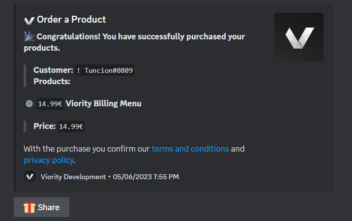

# How to buy a product?


THIS IS _DEPRECATED_ **SINCE** THE **TRANSITION TO KEYMASTER**


**Thank you for your interest** in one or more of our products. We know that our system is unique and may not seem immediately understandable to some. For this this tutorial, here is explained step by step how you can easily complete the checkout successfully.


Please make sure that your DMs are activated: [how-to-activate-dms-on-discord.md](how-to-activate-dms-on-discord.md "mention")


## Start the Purchase

1. Go to our [official discord server](https://discord.gg/323HfHyGW4).
2. Visit the Channel [「🛒」order](https://discord.com/channels/420677294345158657/883023777259212831/1104473886449479701).
3.  Click on the Order Button.\

    

    <figure><figcaption>
Order Button
</figcaption></figure>

    

4. After you click "**🛒 Order**", you should receive a direct message from our bot.
5.  Now choose your product category.\

    

    <figure><figcaption>
Example of the category list
</figcaption></figure>

    

6.  Now choose your product/s. **Advice:** You can choose multiple products!\

    

    <figure><figcaption>
Example of the product list
</figcaption></figure>

    

7. By clicking outside the menu you confirm the input.
8.  You are now in the **checkout overview**. Here you can see all the products currently in your shopping cart and their prices.\
    **You now have 4 options:**\
    \
     = **Proceed to checkout**\
     = **Do you have a coupon code? Use it here to save money!**\
     = **Do you want to add another product? Click here to return to the menu.**\
     = **Do you have made a mistake? Start over and reset your checkout.**\

    <figure><figcaption>
Example of the checkout overview
</figcaption></figure>


You can also click on order in the specific product channel to add it to the checkout.


9. Once you are done click **confirm to continue**.
10. &#x20;Afterwards, you must now choose your payment method.\
    **You now have 3 options:**\
    \
     = **Pay with PayPal**\
     = **Pay with PaysafeCard**\
     = **Pay with Stripe**\
    \
    **-> Use stripe if you want to pay via the following ways:**\
    **-->**  _Mastercard/Visa/American Express_ \
    **-->**  _Apple Pay_ \
    **-->**  _Google Pay_ \
    **-->**  _Klarna_ \
    **-->**  _SOFORT/SEPA/GiroPay/iDEAL/Bancontact/Eps_ \
    **-->**  _Przelewy24_ \
    **-->**  _AliPay_ \
    **-->**  _WeChat_

###  Pay with PayPal

11. Click on the PayPal button.
12. Now an embed is shown with the PayPal checkout.
13. Open the Link to PayPal.\

    <figure><figcaption>
Example of the PayPal Checkout Link
</figcaption></figure>
14. Now you will see a checkout page from PayPal directly, follow the instructions there.\

    <figure><figcaption>
Example PayPal Checkout Screen
</figcaption></figure>
15. Once the PayPal payment is completed, the product will be added to you automatically.

###  Pay with PaysafeCard


Due to the **PaysafeCard guidelines** we can only accept **German cards**!!!


11. Click on the PaysafeCard button.
12. Now enter the PaysafeCard Code.\

    <figure><figcaption>
Example of the PaysafeCard Embed
</figcaption></figure>
13. Once you have entered the code you will get a confirmation page.
14. Confirm the PaysafeCard Code.\

    <figure><figcaption>
Example of the PaysafeCard Confirm Menu
</figcaption></figure>
15. The code has now been sent with the checkout information to **our staff team**. We will now verify the code, after which you will receive your product.


Please note that the verification can take up to 24h!


###  Pay with Stripe

11. Click on the Stripe button.
12. Now an embed is shown with the Stripe checkout.
13. Open the Link to Stripe.\

    <figure><figcaption>
Example of the Stripe Embed
</figcaption></figure>
14. Now you will see a checkout page from Stripe directly, follow the instructions there.\

    <figure><figcaption>
Example Stripe Checkout Screen
</figcaption></figure>
15. Once the Stripe payment is completed, the product will be added to you automatically.


Bank dependent payments may take **3 - 6 business days** depending on the bank. Real time payments like credit card etc. are completed **directly**!


## Complete Purchase

16. After the payment has gone through all the processes you will receive a confirmation by DM.

<figure><figcaption>
Example of the confirmation embed
</figcaption></figure>

17. You can now **continue** with **the first steps** [..](../../ "mention").
