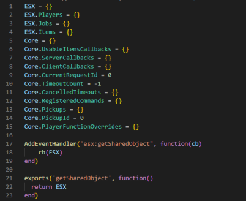

# getSharedObject Deprecated


This es\_extended fix is optional. Please follow all steps carefully!


ESX changed the system for retrieving master data a few months ago. Now they have removed the old approach in the latest versions. Now not all scripts that have been created in the last few years have been rewritten. To fix this, we can temporarily edit the framework to support both methods.

#### 1. Modify the ESX Framework

&#x20;   1.1 Go to the `es_extended` folder.\
&#x20;   1.2 Open the File `client > common.lua`.\
&#x20;   1.3 Replace the Event `esx:getSharedObject`.


```lua
AddEventHandler("esx:getSharedObject", function(cb)
    cb(ESX)
end)
```


<div align="center">

<figure><figcaption><p>Add the Event Handler in the Client File</p></figcaption></figure>

</div>

1.4 Open the File `server > common.lua`.\
1.5 Replace the Event `esx:getSharedObject`.


```lua
AddEventHandler("esx:getSharedObject", function(cb)
    cb(ESX)
end)
```


<figure><figcaption><p>Add the Event Handler in the Server File</p></figcaption></figure>


**Please restart your server to apply the changes!!!**

